# Flat Rental
## About
Flat Rental is a system for posting, searching and browsing advertisements related to long-term rental of apartments. The service allows you to post announcements regarding flats, rooms and places in a room. Announcements can be posted by landlords and tenants. It also offers the option of adding ratings and opinions to the issuers and commenting on advertisements. The application also enables advanced search for advertisements by type, location and given criteria. The application supports synchronization with the TERYT database (Official National Register Of The Territorial Division of Poland).

## Technologies

### Backend
- Java 11
- Hibernate
- Spring
- Elasticsearch
- MySQL

### Frontend
- JavaScript
- React
- Ant Design

## Use cases

### Registration
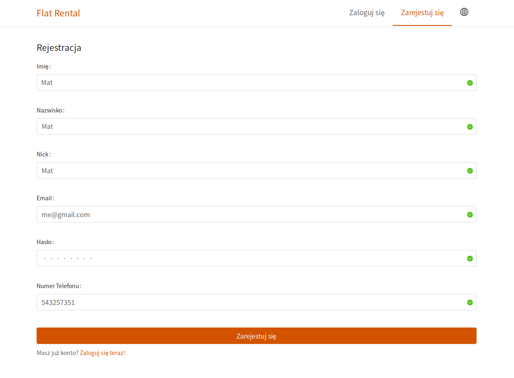

### Login
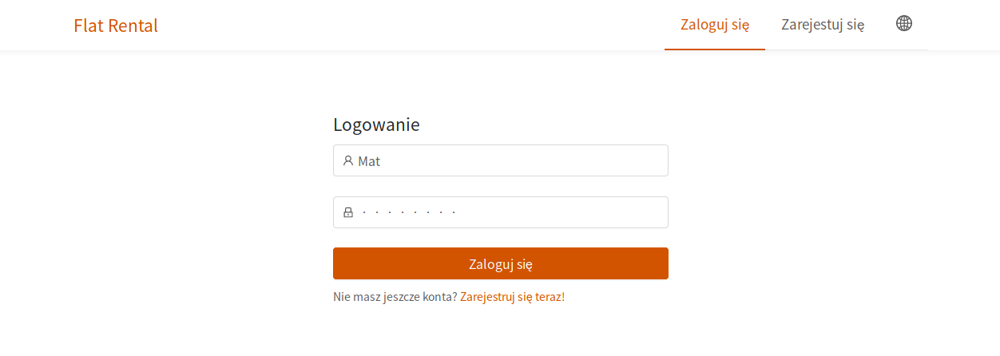

### Announcement creation
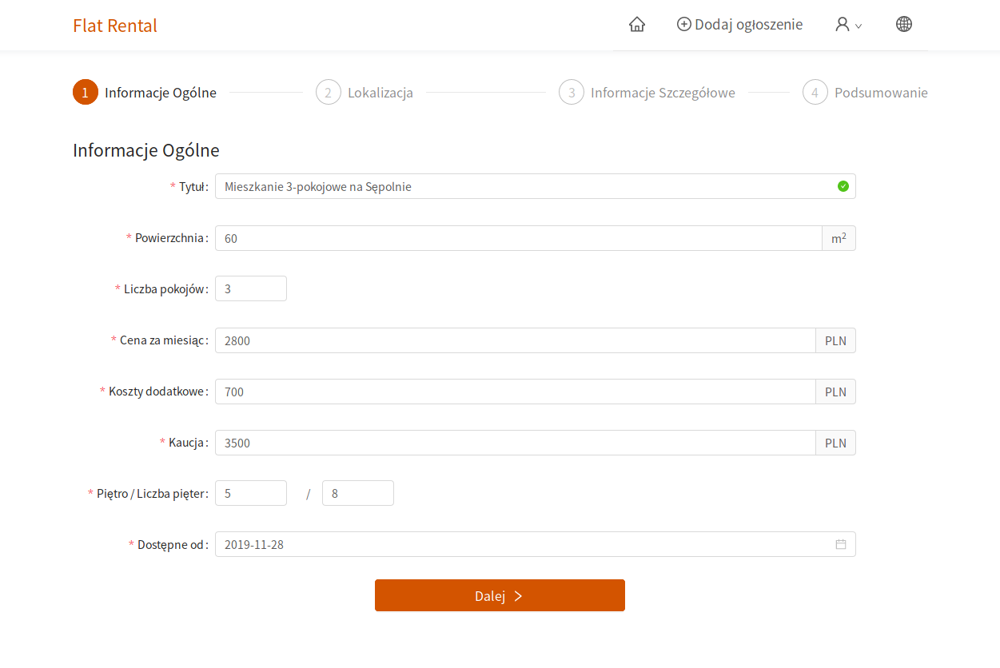
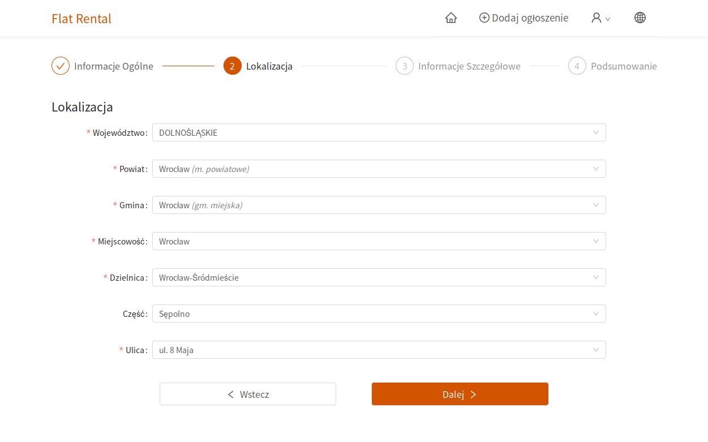
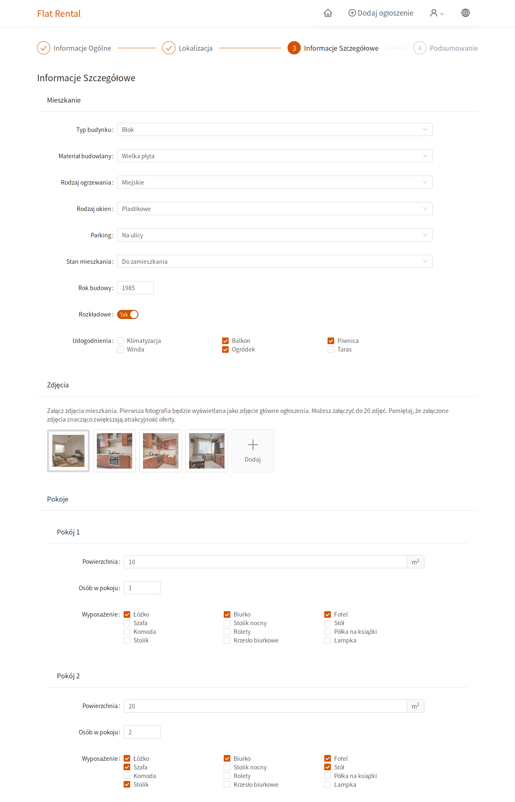
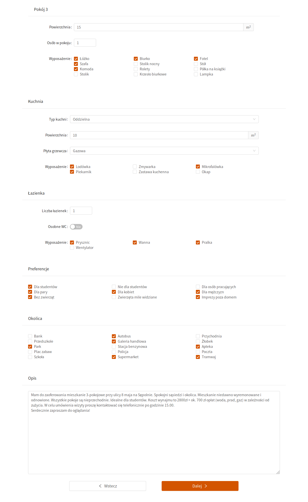

### Announcement search
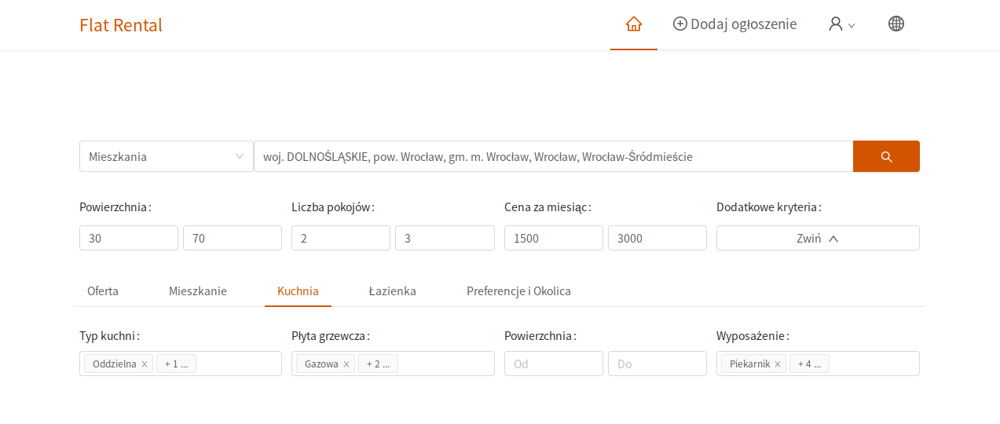
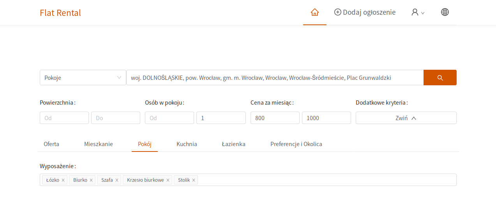
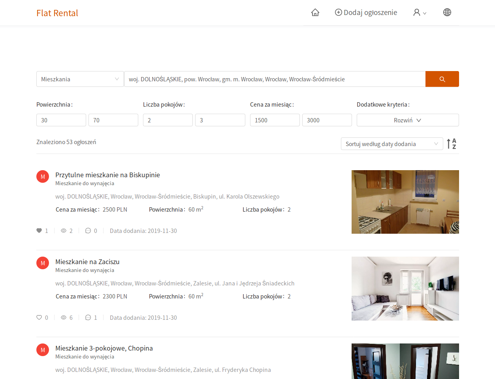

### Announcement details
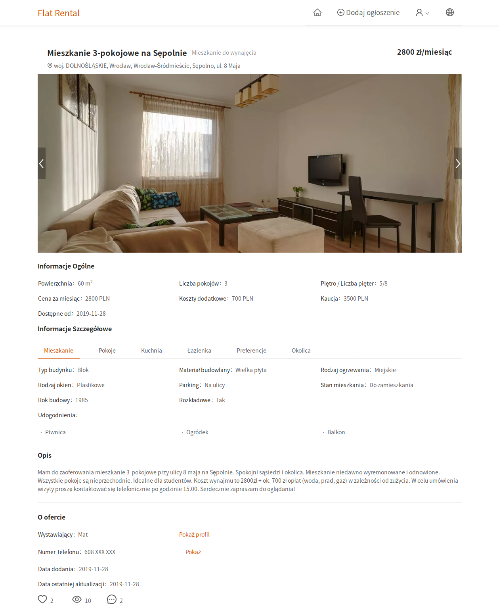

### Comments
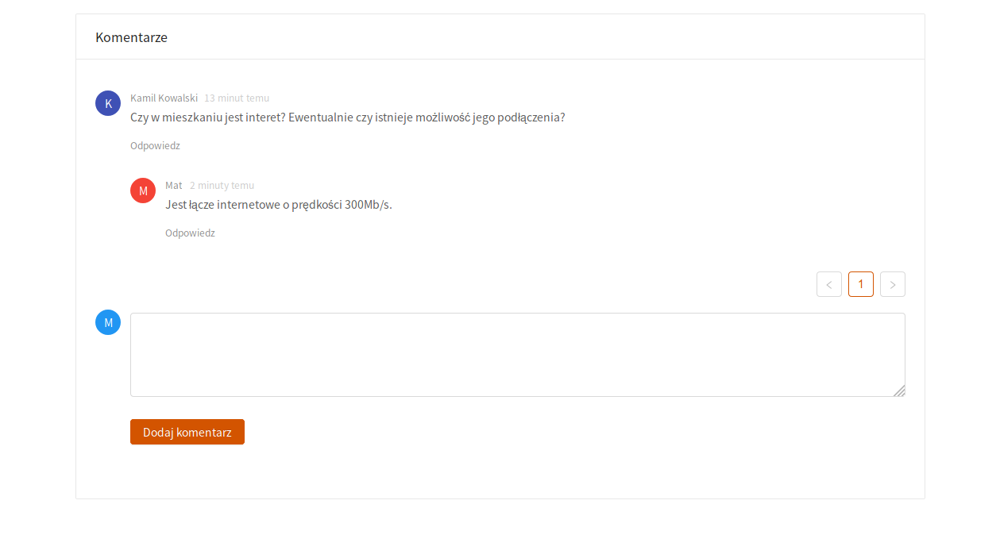

### Account management
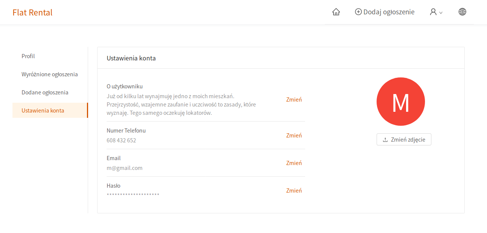
